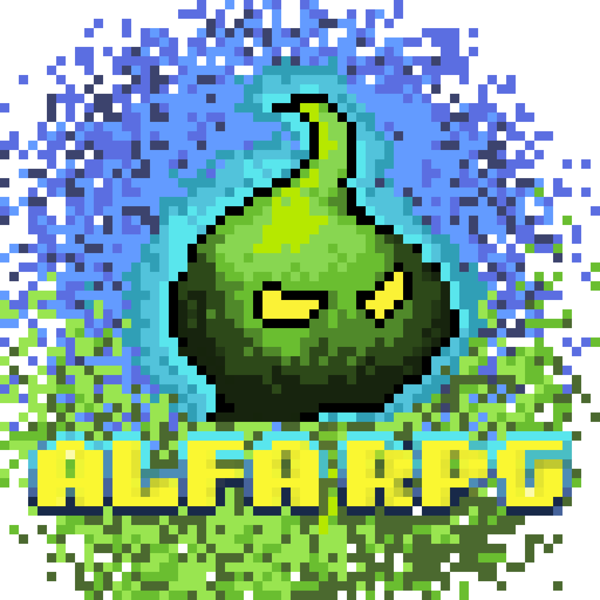

  

> [!IMPORTANT]
> ALFARPG is, ironically, still in alpha. We are looking forward to your feedback!

# ALFARPG
**ALFARPG** is the RPG game project from the minds of **Federico Veronesi**, **Leandro Fiorini**, and **Ambra Pirno**.

## Our Project
This is an **easy-going** game in a simple and intuitive **pixel art** style, made to **relax** and **unwind** after a stressful day of work, school, or life's adversities. You will ***never*** be stuck or have to consult a wiki when playing **ALFARPG**.

## How to Play
Go to [alfarpg.fredver.it](https://alfarpg.fredver.it)  with your **pc**, **phone**, or **tablet**, and start playing!

## The Team
Two dedicated developers: **Leandro** and **Federico**, and a talented artist, **Ambra**, came together and decided that a game was in order to be made. **Federico** and **Leandro** met when the latter was looking to learn how to code, and the former for someone to teach to. **Ambra** and **Federico** met way back in middle school, and again at the gym many years later, where they exchanged ideas and she told him her dream was to work in the videogame industry. Then **Federico** united the powerful trio into one team.

## Our Stack
We use **TypeScript** with the **Phaser** JavaScript framework, and **Aseprite** for the art. The game runs exclusively on the client, with the server only providing the source files for the player's browser to execute. The save files are cookie-based, with no server validation. The server is a VPS that Federico rents and manages.
